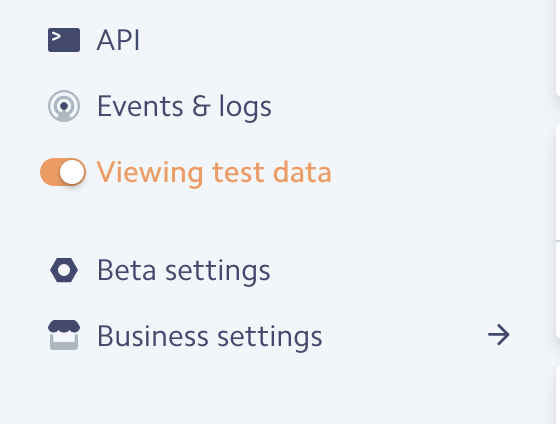
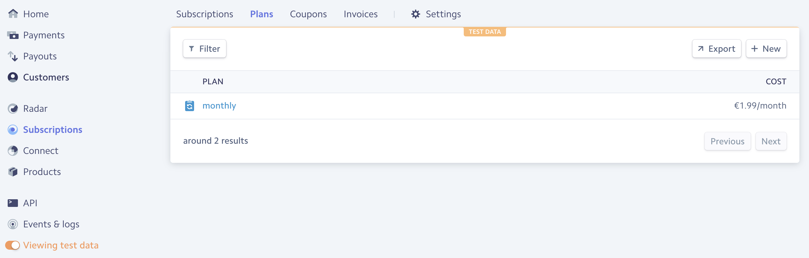

# payments

## create-subscription service

used as a POST endpoint to handle customer and subscription creation.

```
cd create-subscription
```

configure a `.env` and `.env.development` (starting from `.env.sample`) with the application secrets.

## stripe test configuration

### access the dashboard
in your [stripe dashboard](https://dashboard.stripe.com) take a look at the sidebar.

### enable test data

at the bottom of the sidebar you should see the entry "Viewing test data", and you should enable it.



### create a test plan 'monthly'

you should create a plan called 'monthly' view its id 'monthly' and with a recurrence of a month.

here is an example:




## test

```
npm t
```

## development

```
npm start
```

```
npm run deploy
```

